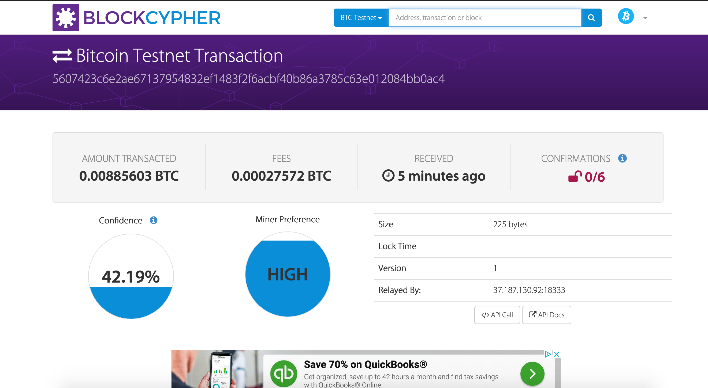
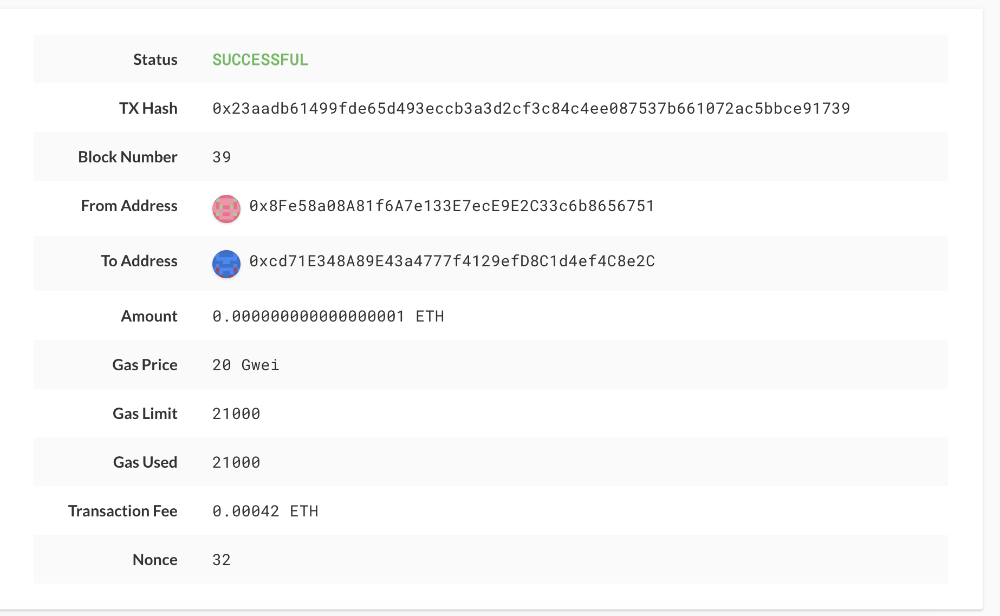

# 19_Homework

BTCTEST Transaction 
Code: 
btc_user = priv_key_to_account(BTCTEST,"PRIVATE KEY") 
send_tx(BTCTEST,btc_user,'mfp9aXg1gqgJSnbXBGB6MKhyjC1UkZ46EX',0.000800) 

ETH Transaction 
Code: 
user_account = priv_key_to_account(ETH,"PRIVATE KEY") 
send_tx(ETH,user_account,"0xcd71E348A89E43a4777f4129efD8C1d4ef4C8e2C",1) 

 
 

The Wallet allows you to send transactions from the command line and uses HD-Wallet-Derive to pull in private keys for your different cryptocurrencey wallets. To use, you will need to navigate to your wallet folder using terminal and run Python and also import your wallet using the command 'from wallet import [star]'. You will need to pull in your keys using the priv_key_to_account(coin,privkey) function. Once you have your keys you can run the send_tx(coin,account,to,amount). Make sure to pass in the coin, your account(priv_key), recipient address, and the amount into the function.
